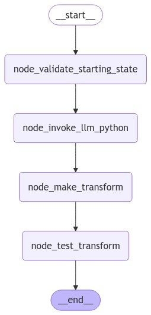

# LP03

This package contains some prototype code to learn more about using LangGraph workflows for autonomous code generation. This workflow is [orchestrated using LangGraph](https://github.com/langchain-ai/langgraph) and runs against Claude 3.5 Sonnet running in AWS Bedrock.  It is currently a chain, as shown below:



The code takes a (currently hardcoded) ES 6.8 Index JSON w/ multi-type mappings and generates a Python transform function that converts it into an OS 2.14 compliant format.  It then executes the transform on that input and PUTs the indices against an OpenSearch Target Cluster (currently a hardcoded network location) to confirm the transform.

When run, it produces a collection of files in a specified location (currently hardcoded to `/tmp/transforms`) related to the transformation.  A random UUID is generated as an identifier for each transform created.
* `UUID_input.json`: The raw JSON input
* `UUID_output.json`: The final, transformed version of the input JSON
* `UUID_report.json`: A report file that contains the input, the output, whether the transform appears successful, and key events in the transform testing process.
* `UUID_transform.py`: The Python transformation function

### Running the code

#### Locally
To run the code locally, use a Python virtual environment.  You'll need AWS Credentials in your AWS Keyring, permissions to invoke Bedrock, and to have onboarded your account to use Claude 3.5 Sonnet.

```
# Start in the repo root

python3 -m venv venv
source venv/bin/activate

(cd lp03 && pipenv sync --dev)
python3 ./lp03/testing.py
```

This will kick off the LangGraph workflow with a sample code generation task.

### Dependencies
`pipenv` is used to managed dependencies within the project.  The `Pipefile` and `Pipefile.lock` handle the local environment.  You can add dependencies like so:

```
pipenv install boto3
```

This updates the `Pipfile`/`Pipfile.lock` with the new dependency.  To create a local copy of the dependencies, such as for bundling a distribution, you can use pip like so:

```
pipenv requirements > requirements.txt
python3 -m pip install -r requirements.txt -t ./package --upgrade

zip -r9 lp03.zip tools/ package/
```